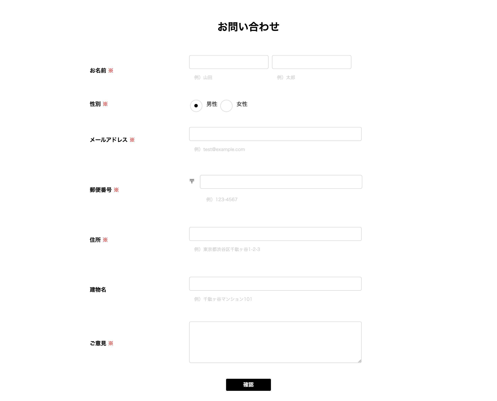
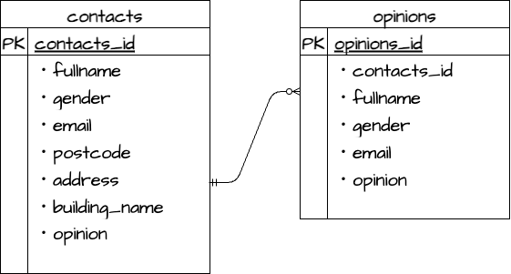

# 20231024_fukaokanna_checklaravel

# お問い合わせ管理システム

***

## 目的
* お客様がいつでも気軽に問い合わせ出来るようにするため。
* お客様の意見を伺い、今後のサービス向上に役立てるため。

***

## 機能一覧
* 登録機能
* 検索機能
* 削除機能(物理削除)
* ページネーション機能

***

## 使用技術
* larval 8.x
* PHP
* MySQL 8.0.26
* Niginx
* Docker/Docker-compose

***

## テーブル設計
### contactsテーブル
|Column|Type|Options| 
|:---:|:---:|:---:| 
|fullname|string|null: false|
|gender|tinyInteger|null: false,(1:男性,2:女性)|
|email|string|null: false|
|postcode|string|null: false|
|address|string|null: false|
|building_name|string|———|
|opinion|text|null: false|

### opinionsテーブル
|Column|Type|Options| 
|:---:|:---:|:---:| 
|contacts_id|bigint|null: false|
|fullname|string|null: false|
|gender|tinyInteger|null: false,(1:男性,2:女性)|
|email|string|null: false|
|opinion|text|null: false|

***

## ER図

 
